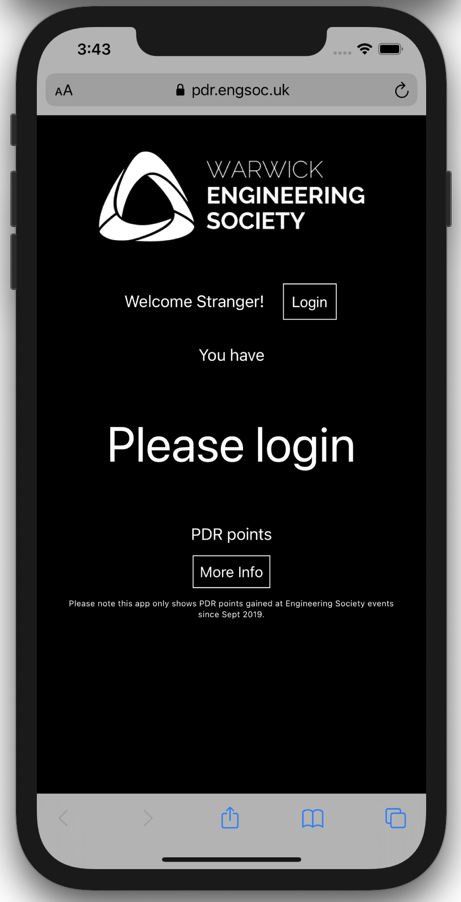
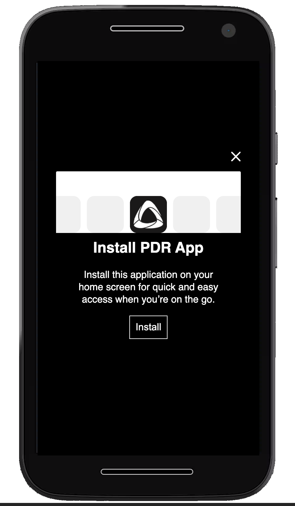
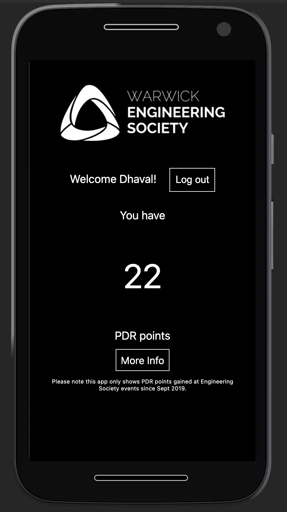

# Warwick Engineering Society PDR App

This is an application for Warwick Engineering Society Members to be able to view PDR Points gained at Engineering Society events.

This repository can also be used as an template project for working with University of Warwick SSO and JavaScript. Theoretically this project could easily be translated into an API for a React or Vue app.

## Screenshots

<!-- prettier-ignore -->
| | | |
|:--:|:--:|:--:|
||||

## Technologies Used

-   JavaScript
    -   NodeJS
    -   ExpressJS
    -   Passport and [Passport-saml](https://github.com/node-saml/passport-saml)
-   EJS Templating Language
-   SAML
    -   This app integrates with University of Warwick SSO using SAML
-   PWA (Progressive Web App)
    -   [pwa-install-prompt](https://github.com/JacobDB/pwa-install-prompt)
    -   Service Worker

## Development

1. Read about Warwick SSO [here](https://warwick.ac.uk/services/its/servicessupport/web/sign-on/development/)
1. Fill out a request with ITS [here](https://warwick.ac.uk/services/its/servicessupport/web/sign-on/development/newservice/)
1. (Optional) Make a fork of this project
1. `git clone` this repo or your fork on the server with SSL set up behind NGINX or Apache.
1. You should develop on the remote server as you need to provide valid metadata later to ITS, so I recommend using VSCode's Remote SSH Plugin which you can get [here](https://marketplace.visualstudio.com/items?itemName=ms-vscode-remote.remote-ssh)
1. Copy `sample.env` to `.env` and fill in the details
    - Leave DEBUG set to TRUE until UoW grant you access to the production SAML IDP systems.
1. Run `npm start` to start development
1. ITS will ask you for "Service Provider (SP) metadata". You can find this at `https://domain.com/saml/Shibboleth.sso/Metadata`
1. They should help you if you run into any issues.
