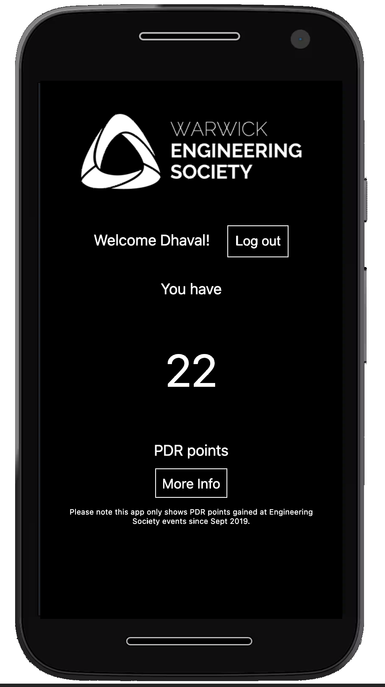

# Warwick Engineering Society PDR App

This is an application for Warwick Engineering Society Members to be able to view PDR Points gained at Engineering Society events.

This repository can also be used as an template project for working with University of Warwick SSO and JavaScript. Theoretically this project could easily be translated into an API for a React or Vue app.

<!-- ## Screenshots

<!-- prettier-ignore 
| | | |
|:--:|:--:|:--:|
||||
-->

## PDR Points

### What are PDR Points?

Professional Development Requirement points, or PDR for short are allocated to certain events by the School of Engineering. Their purpose is to introduce students to aspects of professional practice. Further information is available on the [Engineering Student Office website](https://warwick.ac.uk/fac/sci/eng/eso/undergraduate_students/c-admin/pdr). 

### Why do I need PDR points?

To progress to the 4th Year of an MEng degree, the School of Engineering requires each student to have obtained a minimum of 12 PDR points by the end of the first term of their 3rd Year.

### How do I obtain PDR points?

Simply attend any event that allocates PDR points and make sure your attendance is recorded. All Engineering Society conferences, site visits and careers events provide PDR points, so going to those is an easy way to hit your requirement. 

## Technologies Used

-   JavaScript
    -   NodeJS
    -   ExpressJS
    -   Passport and [Passport-saml](https://github.com/node-saml/passport-saml)
-   EJS Templating Language
-   SAML
    -   This app integrates with University of Warwick SSO using SAML
-   PWA (Progressive Web App)
    -   [pwa-install-prompt](https://github.com/JacobDB/pwa-install-prompt)
    -   Service Worker

## Development

1. Read about Warwick SSO [here](https://warwick.ac.uk/services/its/servicessupport/web/sign-on/development/)
1. Fill out a request with ITS [here](https://warwick.ac.uk/services/its/servicessupport/web/sign-on/development/newservice/)
1. (Optional) Make a fork of this project
1. `git clone` this repo or your fork on the server with SSL set up behind NGINX or Apache.
1. You should develop on the remote server as you need to provide valid metadata later to ITS, so I recommend using VSCode's Remote SSH Plugin which you can get [here](https://marketplace.visualstudio.com/items?itemName=ms-vscode-remote.remote-ssh)
1. Copy `sample.env` to `.env` and fill in the details
    - Leave DEBUG set to TRUE until UoW grant you access to the production SAML IDP systems.
1. Run `npm i` to install dependencies
1. Run `npm start` to start development
1. ITS will ask you for "Service Provider (SP) metadata". You can find this at `https://domain.com/saml/Shibboleth.sso/Metadata`
1. They should help you if you run into any issues.

## Contributors
<!-- If you wanted to be added here please submit a Pull Request -->

- [Dhaval Soneji, Head of Technology 2020-2022](https://github.com/soneji) (main developer and project owner)

## Licensing

This code is Licensed under the GNU AFFERO GENERAL PUBLIC LICENSE Version 3. The main takeaway for someone using this project to develop their own SAML application based on any code in this repository is that you must Open-Source it, under the same AGPLv3 License. 
